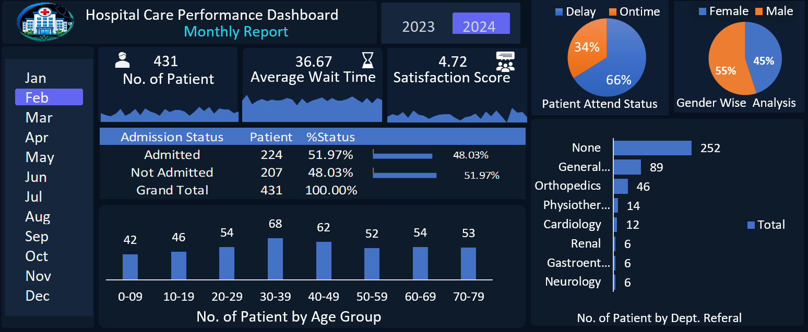

# Hospital Care Performance Dashboard

## Overview
An interactive Hospital Care Performance Dashboard created using Microsoft Excel to analyze patient data and healthcare performance metrics.

## Key Insights
- Patient Admission Status Analysis
- Average Wait Time
- Patient Satisfaction Score
- Gender-wise Analysis
- Age Group Analysis
- Department-wise Referral Analysis
- Monthly Performance Tracking

## Tools Used
- Microsoft Excel
- Pivot Tables
- Pivot Charts
- Slicers
- Data Cleaning
- Dashboard Design

## Dashboard Preview

